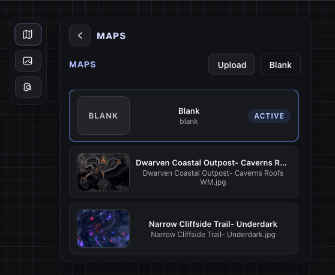
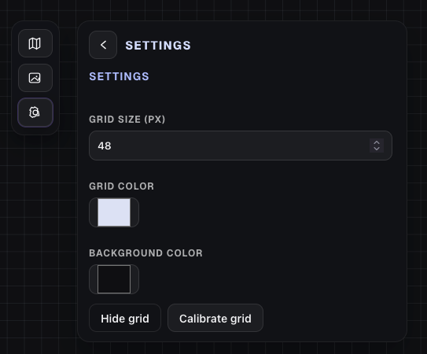
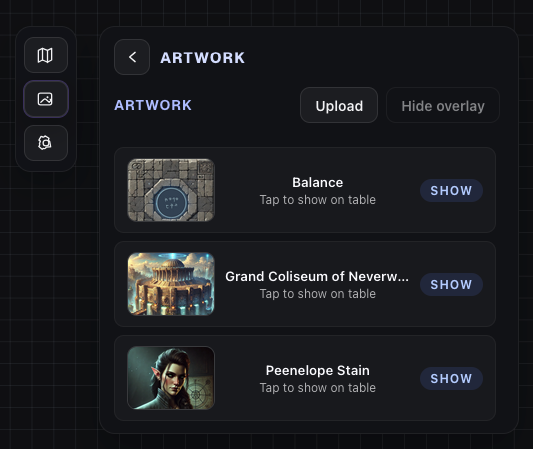

## Kernel Virtual Tabletop

Free, lightweight VTT with two roles: DM and Table. Upload maps or artwork, calibrate grids in seconds, and drive the player view with a live lens—all synced over WebSocket.

## Demo & screenshots

- Short walkthrough video: [Demo 1080](screenshots/Demo%201080.mp4)
- In-app views:
  - 
  - 
  - 

## Quick start (Docker)

- Image: `ramongebben/kernels-vtt` on Docker Hub
- App: http://localhost:3000
- WebSocket server: ws://localhost:8081
- Data: mount `/app/maps` and `/app/artworks` (grid metadata in `maps/metadata.json`)

Compose example:

```yaml
version: '3.8'
services:
  kernel-vtt:
    image: ramongebben/kernels-vtt:latest
    container_name: kernel-vtt
    restart: unless-stopped
    environment:
      PORT: 3000 # Next.js port
      WS_PORT: 8081 # WebSocket server port
    ports:
      - '3000:3000'
      - '8081:8081'
    volumes:
      - /srv/disk1/appdata/KernelVTT/maps:/app/maps
      - /srv/disk1/appdata/KernelVTT/artworks:/app/artworks
```

Run directly:

```bash
docker run -d --name kernel-vtt \
  -p 3000:3000 -p 8081:8081 \
  -v /srv/disk1/appdata/KernelVTT/maps:/app/maps \
  -v /srv/disk1/appdata/KernelVTT/artworks:/app/artworks \
  -e PORT=3000 -e WS_PORT=8081 \
  ramongebben/kernels-vtt:latest
```

Build/publish locally:

```bash
docker build -t ramongebben/kernels-vtt:latest .
docker push ramongebben/kernels-vtt:latest
```

docker compose up (using the published image):

```bash
docker compose up -d        # uses the included docker-compose.yml example
# or supply a path:
docker compose -f docker-compose.yml up -d
```

## Highlights

- DM and Table views (Next.js App Router)
- Grid size/color/background configuration with calibration overlay
- Map and artwork upload/list/delete via Next API routes
- Live viewport lens controlling the table view
- Debounced connection banner + auto-reconnect when WebSocket drops
- Playwright E2E, Vitest unit/coverage suites

## Development setup (Node)

Prereqs: Node 24 (see `.nvmrc`), npm.

Install deps:

```bash
npm ci
```

Start the WebSocket server (in a second terminal):

```bash
cd server
npm install
npm run dev   # WS server on 8081 by default
```

Run the app:

```bash
npm run dev   # http://localhost:3000
```

Optional env:

- `PORT` – Next.js server port (default 3000; exposed in the container)
- `WS_PORT` – WebSocket server port (default 8081)
- `NEXT_PUBLIC_WS_URL` – override ws endpoint (defaults to ws(s)://<host>:8081)
- `NEXT_PUBLIC_WS_PORT` – override default WS port used when building the URL in the browser
- `DEBUG_WS` – set to `true` to log incoming WebSocket messages

## Scripts

- `npm run lint` – eslint
- `npm run test` / `test:watch` – Vitest
- `npm run test:coverage` – Vitest with V8 coverage
- `npm run e2e` / `e2e:headed` / `e2e:ui` – Playwright tests (install browsers first with `npx playwright install --with-deps`)
- `npm run build` / `start` – Next production build/start

## CI

GitHub Actions workflow (`.github/workflows/ci.yml`) runs lint, unit/coverage, then Playwright E2E against a built app on pushes/PRs to main/master.

## Docker publishing

- Release workflow (`.github/workflows/docker-release.yml`) builds and pushes `ramongebben/kernels-vtt` for `linux/amd64` and `linux/arm64` on release publish or manual dispatch.
- Requires secrets `DOCKERHUB_USERNAME` and `DOCKERHUB_TOKEN` with push access to Docker Hub.
